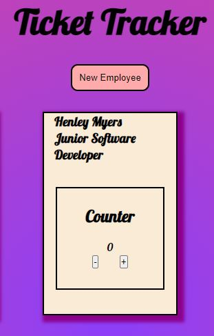

  

<h3 align="center">Ticket Tracker</h3>

---

 This app allows you to track tickets between employees so that everyone in the team knows how much people are doing. You can also add any addition team members you have working that day. 
      

## 📝 Table of Contents

- [About](#about)
- [Usage](#usage)
- [Built Using](#built_using)
- [TODO](#toDo)
- [Contributing](../CONTRIBUTING.md)
- [Authors](#authors)
- [Acknowledgments](#acknowledgement)

## 🧐 About 

This project was built to imporve my skills with react. I was tasked with creating an app that will allow employees to track the amount of tickets each person has. To create this app I would need to use states and props. 
I also added an extention to the intial project to allow for a new member of the team to be added, so that they can also track the tickets they have. 

This project pushed me to understand why components are useful and should be presentable so that they can be reused. This creates dynamic use throughout the app and using props and containers to do the heavy lifting of functions. 

## ✔️ ToDo 

- Allow for employees to be searched
- To have the new employee form be a modal

## 🎈 Usage 

The use for this project is when you and your team need to track who has tickets they are working on, and also add any extra team members that will be working that day. 

## ⛏️ Built Using 

- [JavaScript](https://www.javascript.com/) - Code Language
- [React](https://reactjs.org/) - Web Framework

## ✍️ Authors 

- [@BrookeVerse](https://github.com/BrookeVerse) - Developed By

## 🎉 Acknowledgements 

The _nology coaches who trained us in using react, so that we could use that knowledge to create an app from scratch. 
